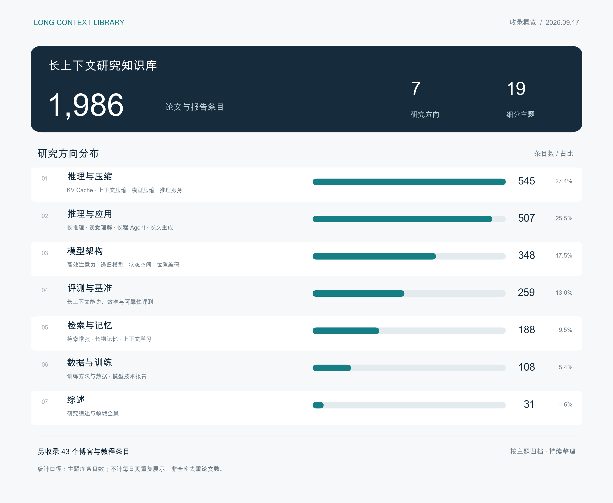

# Long Context Library · 长上下文研究资料库

长上下文建模的论文、模型报告与技术资料。选择下面的具体主题可直接阅读条目。

## 收录统计

共 **1,986 个论文及报告条目**，覆盖 **7 个研究方向、19 个细分主题**；另收录 **43 个博客与教程条目**。统计不计每日页重复展示，不等于全库去重论文数。

## 每日新论文

[按日期浏览](daily/README.md) · [2026-09-17 收录页](daily/2026/2026-09-17.md) · [收录模板](daily/TEMPLATE.md)

按收录日保存新论文、版本更新和项目动态，再关联到下方主题目录。

**最新补录：62 篇**，检索首次提交日期范围为 2026-08-14—2026-09-17。[查看本次补录与检索说明](daily/backfill-2026-09-17.md)。

## 数据与训练

| 数据 | 模型训练 | 训练效率与适配 |
| --- | --- | --- |
| [文档组织与拼接](library/training/data-organization.md) | [继续预训练与训练目标](library/training/continued-pretraining.md) | [训练系统与效率](library/training/training-systems.md) |
| [数据选择与配比](library/training/data-selection.md) | [指令微调与对齐](library/training/supervised-finetuning.md) | [编码器、记忆与架构适配](library/training/architecture-adaptation.md) |
| [数据合成与增强](library/training/data-synthesis.md) | [偏好优化与反馈](library/training/preference-optimization.md) | [测试时训练与适配](library/training/test-time-adaptation.md) |
| | [强化学习](library/training/reinforcement-learning.md) | |

## 架构与上下文机制

- [高效注意力](library/architecture/efficient-attention.md)
- [递归 Transformer](library/architecture/recurrent-transformers.md)
- [状态空间与混合架构](library/architecture/state-space-models.md)
- [位置编码与长度外推](library/architecture/position-encoding.md)

## 推理、缓存与压缩

- [KV Cache：淘汰、量化与卸载](library/inference/kv-cache.md)
- [上下文与输入压缩](library/inference/context-compression.md)
- [模型量化、蒸馏与剪枝](library/inference/model-compression.md)
- [推理加速与服务系统](library/inference/inference-acceleration.md)

## 检索与记忆

- [检索增强生成](library/memory-retrieval/retrieval-augmented-generation.md)
- [长期记忆](library/memory-retrieval/long-term-memory.md)

## 上下文学习、推理与生成

- [上下文学习与 Many-shot](library/memory-retrieval/in-context-learning.md)
- [长推理与测试时计算](library/applications/long-reasoning.md)
- [长文生成](library/applications/long-form-text-generation.md)
- [视频与图像](library/applications/long-video-image.md)
- [长程 Agent](library/applications/long-horizon-agents.md)

## 模型、评测与入门资料

- [模型与技术报告](library/training/technical-reports.md)
- [评测与基准](library/evaluation/benchmarks.md)
- [综述](library/foundations/survey.md) · [博客与教程](library/foundations/blogs.md)

## 导航与更新

[训练与数据分类说明](library/training/README.md) · [完整目录](library/README.md) · [按问题查资料](guides/find-by-question.md) · [每日论文](daily/README.md) · [历史更新](updates/README.md)

## 维护

论文按研究主题组织，每日收录页记录发现时间、首次提交日期与核查状态。摘要核查不等于全文精读或实验复现。

[MIT 许可证](LICENSE) · [贡献指南](CONTRIBUTING.md)
